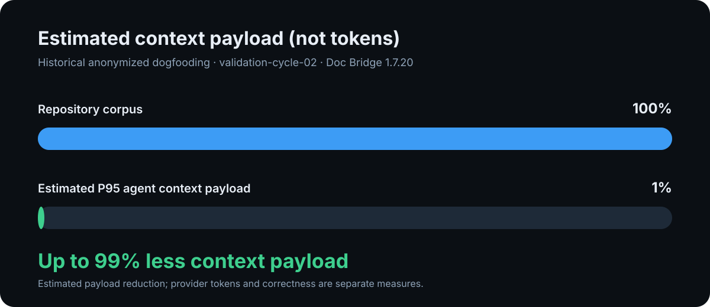

# doc-bridge

[](https://www.npmjs.com/package/@agentskit/doc-bridge)
[](https://github.com/AgentsKit-io/doc-bridge/actions/workflows/ci.yml)
[](https://doc-bridge.agentskit.io/)
[](https://www.bestpractices.dev/projects/13872)
[](LICENSE)
[](package.json)
[](dist/index.d.ts)

**npm:** [`@agentskit/doc-bridge`](https://www.npmjs.com/package/@agentskit/doc-bridge) · **CLI:** `ak-docs` · **Landing:** [agentskit-io.github.io/doc-bridge](https://doc-bridge.agentskit.io/)

**Topics:** `ai-agents` · `documentation` · `developer-experience` · `mcp` · `llms-txt` · `typescript`

**Compatibility:** node >=22 · TypeScript 5.8+ · pnpm, npm, or yarn consumers

**Turn your docs into executable handoffs for coding agents.**

doc-bridge reads your repo docs, ownership map, and human documentation site, then gives humans and agents the same evidence-linked starting point:

- where to start reading
- which files/packages it may edit
- which checks prove the change
- which human docs explain the feature

It is not a wiki or hosted RAG. The core works **without any LLM or API key**; the documentation portal dogfoods AgentsKit Chat as an optional surface over that deterministic layer.


## Built for agent-scale repositories

Doc Bridge turns large repository structure and documentation into compact, evidence-linked context that humans and coding agents can query instead of repeatedly traversing the full repository.

### Up to 99% less context payload

This is an estimated reduction in serialized context payload for one historical benchmark—not a guarantee of token savings or answer quality. It is not the same measure as provider-token usage below.



### Controlled A/B signal

In a controlled study with 96 anonymized executions, the deterministic Doc Bridge workflow showed a directional operational signal of:

- **2.29% fewer paired provider tokens**;
- **3.15 seconds lower P95 latency**;
- **83.3% operationally completed executions vs. 79.2%** with repository-only context.

These are different measures: the 99% figure is an estimated context-payload reduction from anonymized dogfooding, while the 2.29% figure uses provider-token data from 47 paired observations in the controlled run. Neither result establishes semantic correctness or enterprise readiness. See the [full methodology and anonymized data](docs/study/README.md).

## Why teams use it

Agents are powerful, but most repo docs are written for humans. The result is familiar: the agent guesses ownership, edits the sibling package, runs the wrong test, or ignores the human guide that already explained the rule.

doc-bridge works in both directions:


| Direction | What it does | Command |
|-----------|--------------|---------|
| **Human docs → agents** | Turns Fumadocs, Docusaurus, markdown, and ownership docs into `AgentHandoff` | `ak-docs index` · `ak-docs query --agent` |
| **Agent memory → docs** | Reads `.agent-memory/**` and `.cursor/rules/*.mdc`, classifies what should become project docs, and drafts a human-reviewed promotion | `ak-docs memory ingest` · `classify` · `promote --pr` |

The handoff is a routing contract:

```json
{
  "startHere": "docs/for-agents/packages/auth.md",
  "editRoots": ["packages/auth"],
  "checks": ["pnpm --filter @demo/auth test"],
  "humanDoc": "/docs/guides/auth"
}
```

Workflow runs may carry the same optional `correlation` envelope used by the
AgentsKit runtime and Chat protocol. `operationId` is the cross-repository
identity; `runId`, `sessionId`, `turnId`, `actionId`, and `traceId` retain local
meaning. It is bounded metadata only and must not contain prompts, secrets, or
document content.

That contract works from the terminal, MCP, CI, and optional RAG/chat.

## Documentation quality and reconciliation

Discovery is only the first step. `ak-docs audit documentation` compares declared documentation and ownership with the observed project graph and reports evidence-backed findings for missing coverage, stale relations, structured contradictions, exact duplicates, missing examples, and incomplete maintenance metadata.

Natural-language correctness, unnecessary prose, and semantic redundancy remain explicitly `not-analyzed` until a configured agent or human review evaluates them. Proposed changes stay reviewable and human-approved.

```text
Example finding (anonymized)
  CONTRADICTION · high confidence
  Documentation declaration differs from the observed project relation
  Evidence: 4 source files + 1 documentation declaration
  Action: review ownership and update the canonical document
```

## 60-second proof

```bash
npm i -D @agentskit/doc-bridge
npx ak-docs demo --text
```

No config, no docs to read first. Output shows before/after, a real handoff, gate red→green, and the MCP snippet:

```
After (handoff.resolve / query --agent)
  ✓ target:  auth (packages/auth)
  ✓ start:   docs/for-agents/packages/auth.md
  ✓ edit:    packages/auth
  ✓ checks:  pnpm --filter @demo/auth test · pnpm --filter @demo/auth lint
  ✓ human guide: /docs/guides/auth

Gate: red → green
```

Monorepo fixture with auth + billing:

```bash
npx ak-docs demo --fixture monorepo --text
```

### Verify the real handoff path

This checked example runs the bundled demo through the public CLI. The README gate compares this block byte-for-byte with the executable fixture and runs it on every PR.

<!-- readme-command:verify-handoff -->
<!-- readme-example:verify-handoff -->
```js
import { execFileSync } from 'node:child_process'

execFileSync(process.execPath, ['bin/ak-docs.js', 'demo', '--text'], {
  stdio: 'inherit',
})
```

```bash
node examples/verify-handoff.mjs
```

Full setup in your repo:

```bash
npx ak-docs init
npx ak-docs index
npx ak-docs query package example --agent
ak-docs mcp install --cursor   # wires MCP into .cursor/mcp.json
```

Using Cline? Follow the deterministic [`llms-install.md`](llms-install.md) setup. It runs the pinned MCP server through `pnpm dlx` without adding Doc Bridge to your repository dependencies.

## What ships

See the [surface map](docs/landing/assets/doc-bridge-surfaces.webp) for a visual overview of the CLI, MCP, CI, and adapter surfaces.

| Surface | Use it for | Command / artifact |
|---------|------------|--------------------|
| **CLI** | Inspect ownership, search docs, run gates, ask local questions | `ak-docs query`, `search`, `ask`, `doctor`, `gate` |
| **MCP server** | Let Cursor, Claude Code, Codex-style agents resolve handoffs before editing | `ak-docs mcp`, `handoff.resolve` |
| **GitHub Action / CI** | Fail stale indexes and broken human-doc links on PRs | `AgentsKit-io/doc-bridge@ee756a13c006c597445c31e2643c1e8cece715d7` |
| **Documentation conformance** | Check the stable ecosystem standard with auditable evidence | `ak-docs conformance run documentation-standard-v1 --text` |
| **Documentation audit** | Measure documentation quality and compare docs with the observed project graph | `ak-docs audit documentation --json` |
| **Doc adapters** | Link human docs to agent docs | `fumadocs`, `docusaurus`, `vitepress`, `starlight`, `nextra`, `plain-markdown` |
| **Monorepo routing** | Discover workspaces and checks | `pnpm-monorepo`, `nx` |
| **Memory pipeline** | Turn agent notes into reviewable documentation drafts | `memory ingest`, `classify`, `promote --pr` |
| **Optional RAG/chat** | Ground chat in the same handoff-first index | `@agentskit/rag`, `@agentskit/ink`, `ak-docs chat` |

See [docs/getting-started.md](docs/getting-started.md), [docs/mcp.md](docs/mcp.md), and [docs/examples.md](docs/examples.md).

### Cursor plugin

This repository also contains a Cursor plugin that pairs the read-only Doc Bridge MCP server with a handoff skill. It resolves `startHere`, `readBeforeEditing`, `editRoots`, and `checks` before Cursor edits a routed repository. The plugin does not request credentials or write project files through MCP.

### GitHub Copilot plugin

The root Agent Plugins manifest exposes the same portable handoff skill and read-only MCP server to GitHub Copilot CLI. Copilot discovers `skills/` and `.mcp.json` from the standard plugin layout, so the integration stays source-owned instead of copying prompts into another repository.

```bash
copilot plugin install AgentsKit-io/doc-bridge
```

### Portable Agent Skill

[`skills/doc-bridge-handoff`](skills/doc-bridge-handoff) packages the same fail-closed routing contract in the open Agent Skills layout for OpenClaw-compatible clients, Hermes Agent, Pi, Cursor, and other runtimes that can execute a local skill script. The skill prefers the read-only MCP tool and falls back to a pinned, zero-credential CLI resolver. It never edits files, runs returned checks, or grants authority outside `editRoots`.

Install the published skill from [ClawHub](https://clawhub.ai/emersonbraun/skills/doc-bridge-handoff):

```bash
clawhub install doc-bridge-handoff
```

Pi users can install the same source-owned skill through the npm package:

```bash
pi install npm:@agentskit/doc-bridge
```

## Claude Desktop MCP Bundle

Doc Bridge can be packaged as a local MCP Bundle for Claude Desktop. The bundle keeps the eight MCP tools read-only and asks the user to select the repository's `doc-bridge.config.json`; that file defines the project boundary Doc Bridge may read.

From a clean checkout:

```bash
pnpm install --frozen-lockfile
pnpm mcpb:pack
```

The command builds Doc Bridge, creates a production-only staging directory, validates the MCPB manifest, packs the extension, checks its file inventory, and writes the local artifact under `.mcpb-output/`. Generated bundles and staging directories are intentionally excluded from Git.

Current packaged compatibility is macOS. Other operating systems will be declared only after the exact bundle passes an independent installation test there.

## Why this exists

| Pattern | Gap |
|---------|-----|
| Wiki + RAG | Explains; weak on *where to act* and proof docs match code |
| AGENTS.md alone | Great static rules; no ownership index, gates, or human bridge |
| Context7-class tools | Library docs for the model; not *your* monorepo routing |

doc-bridge ships **AgentHandoff** JSON:

```json
{
  "type": "agent-handoff",
  "startHere": "docs/for-agents/packages/auth.md",
  "editRoots": ["packages/auth"],
  "checks": ["pnpm --filter @demo/auth test"],
  "humanDoc": "/docs/guides/auth",
  "bridge": { "humanDoc": "linked" }
}
```

When a human guide is missing, handoffs surface it as a feature:

```json
{
  "bridge": {
    "humanDoc": "missing",
    "action": "ak-docs bootstrap agent-docs"
  },
  "notes": ["Human guide missing for billing. Run: ak-docs bootstrap agent-docs"]
}
```

## Four loops (with real commands)

| Loop | Command | What you see |
|------|---------|--------------|
| **Act** | `ak-docs query package auth --agent` | `editRoots`, `checks`, `startHere` |
| **Bridge** | `ak-docs bootstrap agent-docs` | Draft agent docs from human site; `bridge.humanDoc` in handoff |
| **Learn** | `ak-docs memory classify` → `promote` | HITL draft for agent corpus |
| **Explain** | `ak-docs ask "auth is broken in staging"` | Ownership match + handoff preview + next commands |

```bash
ak-docs ask "who owns schemas"
# Best match: ownership os-core
# Handoff preview
#   start:  docs/for-agents/packages/os-core.md
#   edit:   packages/os-core
#   checks: pnpm --filter os-core lint · pnpm --filter os-core test
```

## Coverage your team checks daily

```bash
ak-docs doctor --text
ak-docs doctor --badge          # shields.io markdown for README
ak-docs index --watch           # keep index fresh while editing docs
```

```
Score: 82/100 (B)
  Agent docs:      8/10 (80% handoff-ready)
  Human guides:    6/10 (60% bridged)
  Gates:           3/3 passing

Next actions
  → ak-docs bootstrap agent-docs
  → ak-docs query package billing --agent
```

## Agent uses it alone

1. **MCP auto-wire:** `ak-docs mcp install --cursor`
2. **Skill/rule:** paste [docs/skills/doc-bridge.md](docs/skills/doc-bridge.md) into Cursor rules — agents call `handoff.resolve` before editing `packages/*`
3. **Handoff is the next step:** `startHere`, `checks`, and `bridge` are in the JSON/MCP response

## CI as first-class citizen

Reuse the bundled GitHub Action on every PR:

```yaml
permissions:
  contents: read

steps:
  - uses: actions/checkout@v4
  - uses: AgentsKit-io/doc-bridge@ee756a13c006c597445c31e2643c1e8cece715d7 # v1.7.45
    with:
      config-path: doc-bridge.config.json
```

The Action checks the committed index before changing anything, pins the matching npm package, and rejects non-exact package versions. See the [Marketplace guide](docs/MARKETPLACE.md).

 

Run `ak-docs doctor --badge` locally to refresh — or `pnpm coverage:badge` in CI.

Or locally:

```bash
ak-docs index && ak-docs gate run
```

Gate fails with `Index is stale. Run: ak-docs index` — same check in CI annotations.

## Product surface

### Core — always (no LLM)

| Surface | Purpose |
|---------|---------|
| **Demo** | `ak-docs demo` — bundled fixture, no setup |
| **Doctor** | Coverage score, missing humanDoc/agent doc, next actions |
| **Index** | `DocBridgeIndex` + `contentHash` + `llms.txt` + capabilities |
| **CLI** | `query` / `search` / `list` / `ask` / `gate` / `memory` / `bootstrap` |
| **MCP** | `handoff.resolve`, `doc.search`, `doc.get`, `gate.status`, … |
| **Gates** | Freshness, human-link validation, optional OKF style |
| **Adapters** | `pnpm-monorepo`, `nx`, `fumadocs`, `docusaurus`, `vitepress`, `starlight`, `nextra`, `plain-markdown` |

### Optional AgentsKit peers

```bash
npm i -D @agentskit/rag @agentskit/ink @agentskit/adapters @agentskit/memory react
ak-docs rag ingest && ak-docs chat
```

See **[docs/chat-and-rag.md](docs/chat-and-rag.md)**.

## AgentsKit ecosystem

### Who uses it (public)

Designed for and dogfooded on open AgentsKit surfaces:

| Surface | Link |
|---------|------|
| **for-agents** | [agentskit.io/docs/for-agents](https://www.agentskit.io/docs/for-agents) |
| **Registry** | [registry.agentskit.io](https://registry.agentskit.io/) |
| **Playbook** | [playbook.agentskit.io](https://playbook.agentskit.io/llms.txt) |
| **AgentsKit Chat** | [documentation](https://chat.agentskit.io) · [source](https://github.com/AgentsKit-io/agentskit-chat) |
| **Code Review** | [repository-native CLI](https://github.com/AgentsKit-io/code-review-cli) |
| **This repo** | CI green · `ak-docs gate run` on every PR |

**Playbook pattern:** [`docs/playbook/doc-bridge-pattern.md`](docs/playbook/doc-bridge-pattern.md) — export with `ak-docs playbook pattern --text`

## Configuration examples

| Profile | Example |
|---------|---------|
| Solo markdown | [`examples/minimal-plain-markdown.config.ts`](examples/minimal-plain-markdown.config.ts) |
| pnpm monorepo | [`examples/pnpm-monorepo.config.ts`](examples/pnpm-monorepo.config.ts) |
| Nx monorepo | [`examples/nx-monorepo.config.ts`](examples/nx-monorepo.config.ts) |
| Demo monorepo | [`examples/demo-monorepo/`](examples/demo-monorepo/) |
| Fumadocs + chat | [`examples/fumadocs-with-chat.config.ts`](examples/fumadocs-with-chat.config.ts) |
| VitePress | [`examples/vitepress-only.config.ts`](examples/vitepress-only.config.ts) |
| Astro Starlight | [`examples/starlight-only.config.ts`](examples/starlight-only.config.ts) |
| Nextra | [`examples/nextra-only.config.ts`](examples/nextra-only.config.ts) |

Contract: [`docs/spec/config-v1.md`](docs/spec/config-v1.md) · CLI: [`docs/spec/cli.md`](docs/spec/cli.md) · MCP: [`docs/mcp.md`](docs/mcp.md) · Skill: [`docs/skills/doc-bridge.md`](docs/skills/doc-bridge.md) · Pattern: [`docs/playbook/doc-bridge-pattern.md`](docs/playbook/doc-bridge-pattern.md) · Recipes: [`docs/recipes/index-pipeline.md`](docs/recipes/index-pipeline.md)

## Learn loop — memory → draft PR

```bash
ak-docs memory ingest
ak-docs memory classify
ak-docs memory promote --pr --dry-run   # preview gh commands
ak-docs memory promote --pr              # opens draft PR via gh
```

## Status

**Current npm package: v1.7.45 stable** — portable, fail-closed handoffs for Cursor, Pi, Hermes, and ClawHub-compatible clients; deterministic Documentation Standard v1 conformance; verified release provenance; Marketplace Action; doctor + CI + skill; and documentation-quality audit tooling.

```bash
pnpm install && pnpm build && pnpm test
pnpm smoke:ollama    # optional — skips if Ollama/peers unavailable
```

**Landing:** https://doc-bridge.agentskit.io/

## Privacy Policy

The local MCP server reads only the project selected through `doc-bridge.config.json`. It does not require an API key, send project data to AgentsKit, collect telemetry, or write project files through its eight MCP tools. See the complete [Privacy Policy](PRIVACY.md) for accessed paths, use, storage, sharing, retention, optional integrations, and contact information.

## Contributing

Issues and PRs are welcome. Start here:

To improve the evidence base, reproduce the [anonymized study](docs/study/README.md), add a language or framework analyzer, contribute a documentation-quality rule, or add a fixture for a real contradiction or stale relation.

| Need | Doc |
|------|-----|
| Local setup, tests, release flow | [CONTRIBUTING.md](CONTRIBUTING.md) |
| Governance and maintainer responsibilities | [GOVERNANCE.md](GOVERNANCE.md) |
| Vulnerability reports | [SECURITY.md](SECURITY.md) |
| Community standards | [CODE_OF_CONDUCT.md](CODE_OF_CONDUCT.md) |
| Release history | [CHANGELOG.md](CHANGELOG.md) |
| Product positioning | [docs/POSITIONING.md](docs/POSITIONING.md) |

## License

[MIT](LICENSE)
