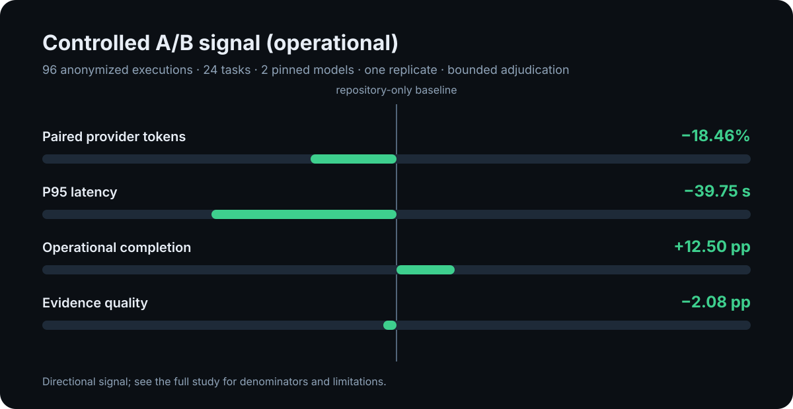

# Documentation efficiency study

The next improvement series is governed by the [Token efficiency improvement
plan](./token-efficiency-plan-v1.md). It separates context-payload reduction,
provider-token reduction, and tokens-to-correct-action so that a smaller
payload cannot be presented as a correctness or token-saving result by itself.

This directory contains the anonymized, versioned evidence behind the Doc Bridge performance narrative. It is designed to let contributors inspect the numbers without exposing repository contents, private paths, prompts, credentials, or raw agent responses.

## Executive summary

An earlier anonymized dogfooding cycle estimated up to **99% context-payload reduction** between the scanned repository corpus and the P95 payload returned to an agent. This is a historical context-payload measurement, not a guaranteed token reduction or correctness result, and it must not be read as a provider-token result.

The published controlled A/B study with 96 executions showed a directional operational signal of 18.46% fewer paired provider token-equivalent units across 46 token-complete pairs and 39.75 seconds lower P95 latency than repository-only context. Operational completion was 87.5% versus 75.0%. The sample is not a causal or enterprise-readiness claim.

The independent bounded adjudicator recorded **0 adjudicator-success outcomes in both arms**. Because this adjudicator is mechanical and does not independently judge semantic correctness, this round does not demonstrate improved task correctness; it remains `inconclusive` and should be used only as an auditable historical directional measurement. A newer local pilot is not included in the public narrative until its semantic evaluation and publication review are complete.

Acceptance telemetry is now checked separately from task correctness: every pilot observation records passed, total, and executed acceptance-check counts, while the deterministic adjudicator blocks a success when any declared check was not observed as executed. This prevents a missing execution measurement from being mistaken for a passing task.

Semantic correctness and natural-language contradiction detection are explicit
limitations of this study, not missing evidence hidden by the publication
artifacts. They remain open validation work for a future adjudicated corpus.




## Evidence classification

| Label | Meaning |
| --- | --- |
| `controlled` | Fixed task, model, scenario, and measurement contract. |
| `estimated` | Derived from bounded measurements where direct provider data was unavailable. |
| `observational` | Real-world dogfooding evidence without a controlled counterfactual. |
| `inconclusive` | Useful signal, but insufficient evidence for a causal claim. |

## Published artifacts

| Artifact | Purpose |
| --- | --- |
| [Protocol](./protocol-v1.json) | Metric definitions, scenarios, privacy boundary, and stopping rules. |
| [Token efficiency protocol v2](./token-efficiency-protocol-v2.json) | Correct-action token metric, evidence gates, and non-regression targets. |
| [Task suite](./task-suite-v1.json) | Fixed anonymized discovery, architecture, documentation, and implementation tasks. |
| [Phase 4 public pilot suite](./phase4-public-pilot-task-suite-v1.json) | One public fixture, four tasks, and explicit pilot-only scope for validating the real runner without duplicating a repository. |
| [Phase 4 public pilot plan](./phase4-public-pilot-run-plan-v1.json) | Hashed 16-observation pairwise pilot using the two configured Codex model slots. |
| [Phase 4 public pilot ledger](./phase4-public-pilot-ledger-v1.json) | Bounded structured observations with hashes, statuses, provider usage, evidence IDs, and automated adjudication. |
| [Phase 4 public pilot result](./phase4-public-pilot-result-v1.json) | Anonymized execution counts, paired token/latency measurements, failed preparation runs, and limitations. |
| [Publication gate v1](./publication-gate-v1.md) | Evidence and claim-boundary checks required before publishing study results. |
| [A/B baseline result](./ab-baseline-result-v1.json) | Controlled repository-only versus deterministic Doc Bridge measurements. |
| [A/B baseline analysis](./ab-baseline-analysis-v1.md) | Human-readable interpretation of the controlled baseline. |
| [Adjudicated A/B result](./ab-adjudicated-cost-result-v1.json) | Cost-attributed execution and independent bounded adjudication. |
| [Round 2](./round-2-expanded-validation-v1.md) | Expanded adjudication and operational measurements. |
| [Round 3](./round-3-evidence-contract-v1.md) | Evidence-coverage contract validation. |
| [Round 4](./round-4-confirmation-v1.md) | Fresh-sample confirmation and final limitations. |
| [Historical evidence](./historical-evidence-v1.json) | Earlier anonymized dogfooding and validation-cycle measurements. |

All publication-bound artifacts pass the deterministic privacy gate. The values are intentionally anonymized and should be interpreted together with their provenance and limitations.

The Phase 4 public pilot is intentionally separate from the six-population canonical suite. It is an execution-path and measurement smoke study, not evidence of enterprise-wide documentation quality or generalization. Its local provider and repository configuration stay outside the publication artifacts; only hashes, bounded observations, and the run identifier belong in published evidence.

## Reproduce the charts

From the repository root:

```bash
node scripts/generate-study-charts.mjs
node scripts/generate-study-charts.mjs --check
```

The generator uses only the checked-in JSON artifacts and Node.js APIs. It does not call an LLM or access a consumer repository.

## What the study does not prove

- It does not prove that Doc Bridge makes every agent answer correctly.
- It does not prove a universal 99% token reduction.
- It does not establish causality across all repositories, languages, or models.
- It does not replace semantic human review of documentation/code contradictions.

The study is a transparent measurement baseline and a contribution surface for better analyzers, adapters, acceptance checks, and future replicates.
